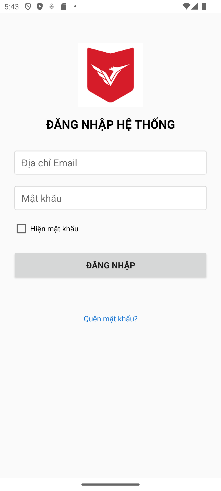
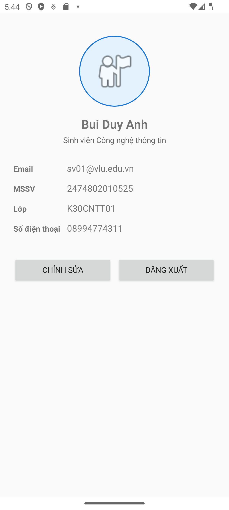
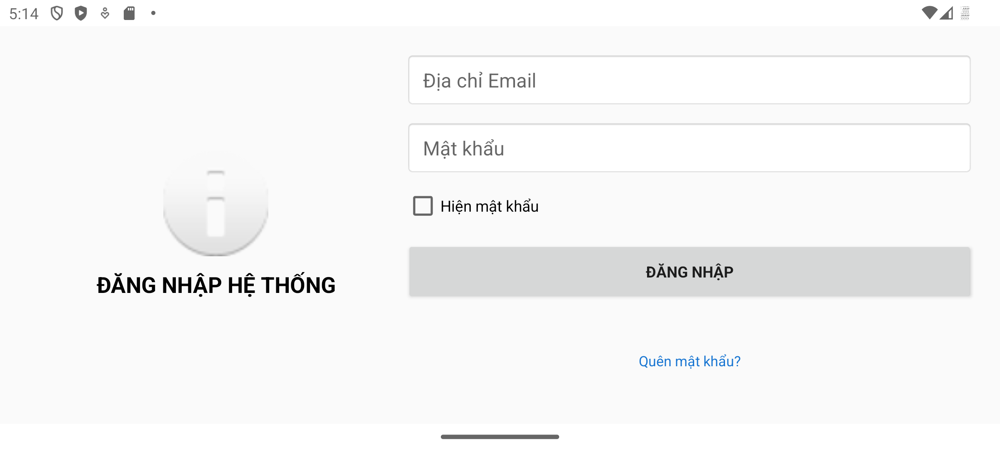
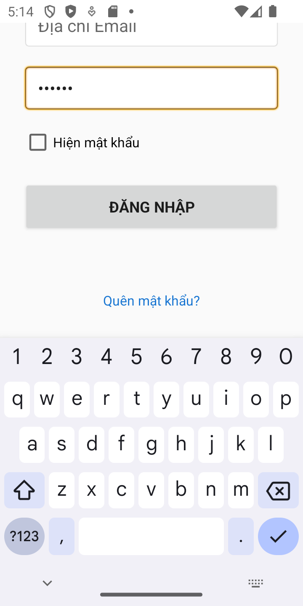
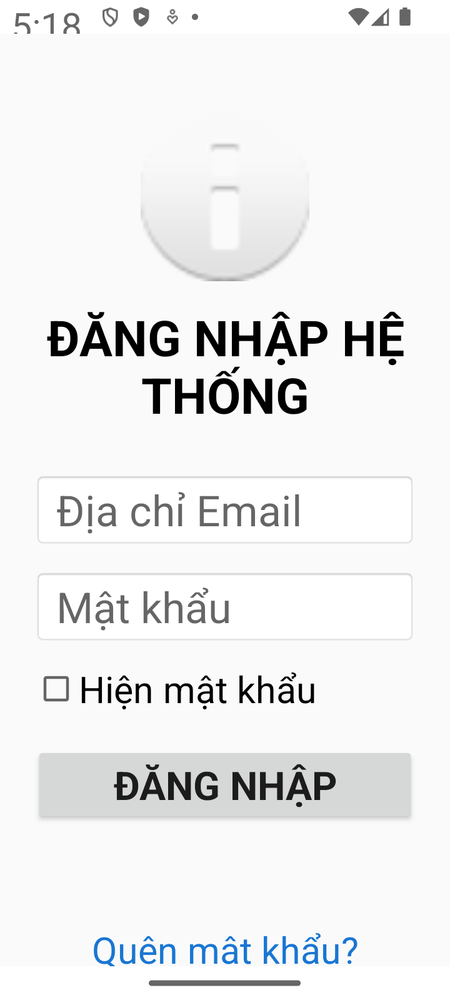
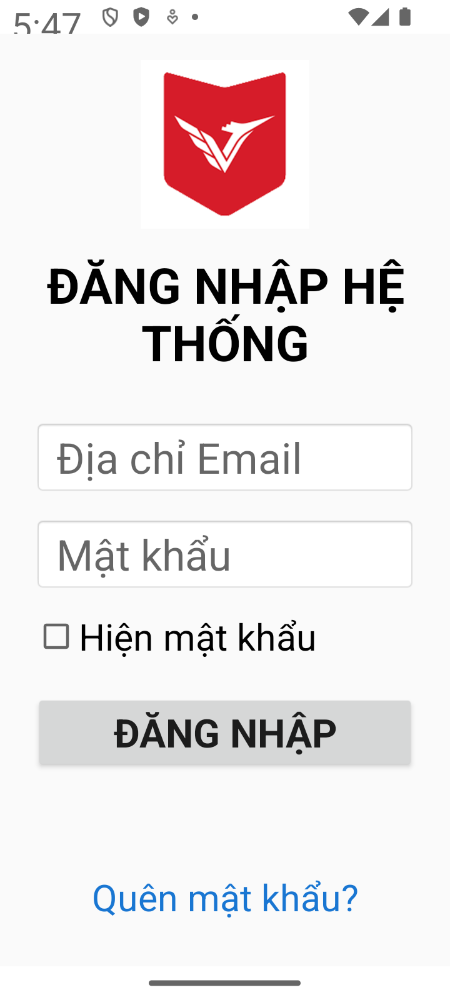
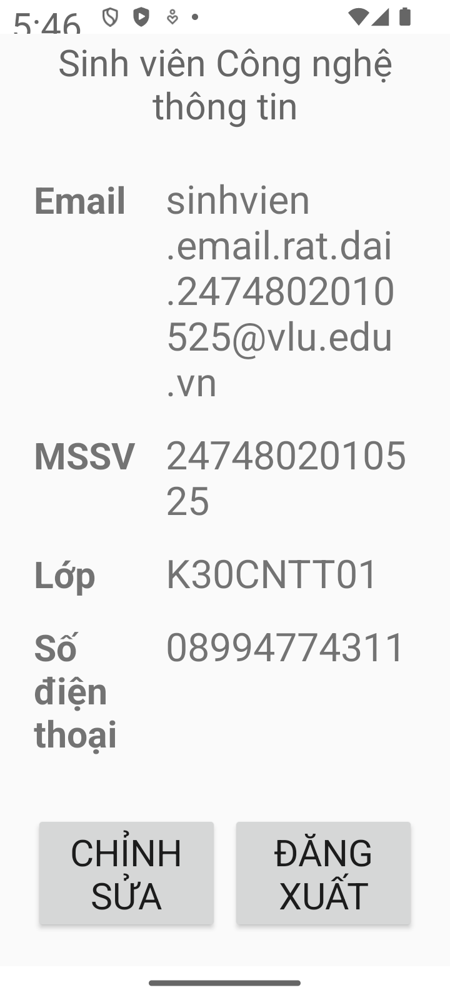
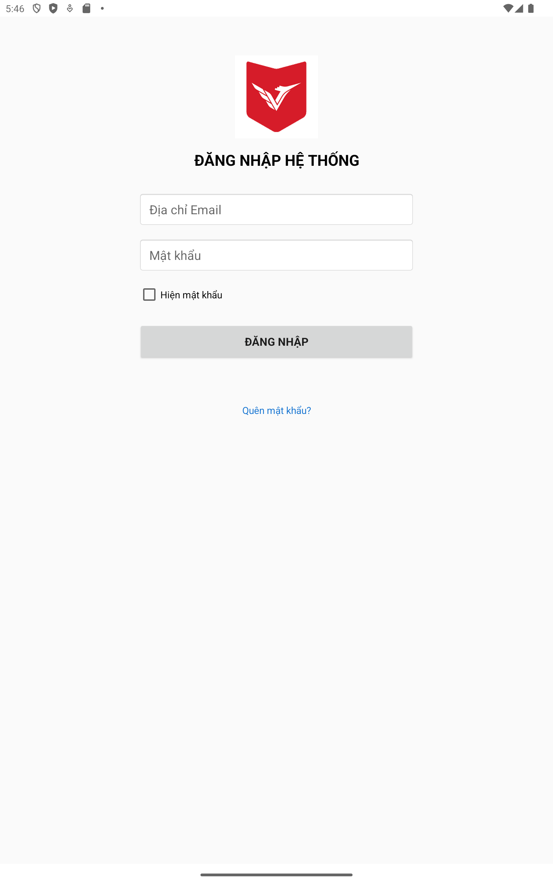
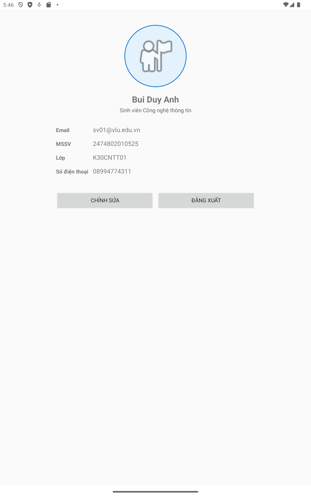
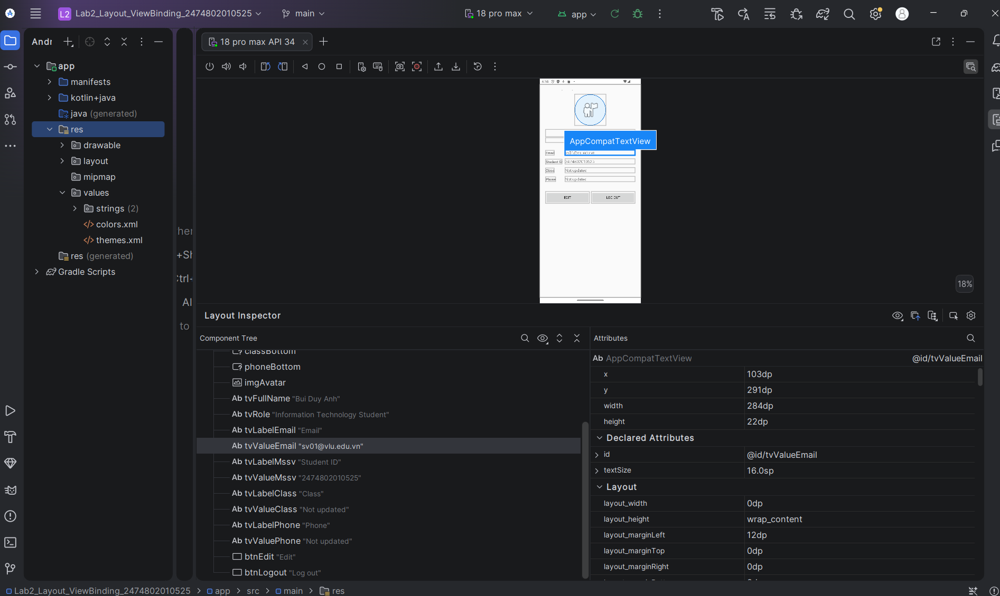

# Lab 02 — XML Layout & ViewBinding

**Student:** Bui Duy Anh  
**Student ID:** 2474802010525  
**Package:** `vn.edu.vlu.lab2`

## Project requirements implemented

- `LoginActivity` is the launcher screen.
- `ProfileActivity` displays the email passed from Login.
- Flat `ConstraintLayout`-based UI inside a `ScrollView` for better small-screen/keyboard handling.
- ViewBinding enabled; no `findViewById()` is used.
- All user-facing strings are in `strings.xml`.
- English resources are included in `values-en/strings.xml`.
- Validation cases:
  - Missing email/password.
  - Invalid email format.
  - Password shorter than 6 characters.
  - Valid login.
- Mandatory exercise: “Quên mật khẩu?” text with Toast.
- Extra practice included:
  - “Hiện mật khẩu” checkbox.
  - Landscape login layout (`layout-land`).
  - Phone row + `Barrier` on Profile.
  - `ScrollView` to avoid content being cut off.
  - Bottom Barriers keep Profile rows separated when values wrap.
  - Input fields and buttons grow with larger system fonts.
  - Tablet layouts (`layout-sw600dp`): centered 400dp Login form and 560dp Profile content area.

## Test data

Use the following valid case:

- Email: `sv01@vlu.edu.vn`
- Password: `123456`

Also test:

1. Both fields empty.
2. Email = `abc`.
3. Password = `123`.
4. Valid data above.

## Responsive verification and screenshots

Screenshots captured from the running Android application on AVD `18_pro_max`, on 6 October 2026. Phone and tablet sizes were simulated on this same AVD with `adb shell wm size` and `wm density`; these are not separate Pixel device tests or physical-device tests. Display, font and app-language settings were restored after testing.

| Scenario | Configuration | Evidence |
|---|---|---|
| Large phone | 1080 × 2400 px, 420 dpi, font scale 1.0 | [Login](screenshots/login.png), [Profile](screenshots/profile.png) |
| Small phone | 720 × 1440 px, 360 dpi (320dp wide) | [Login](screenshots/login_small.png) |
| Keyboard visible | Small phone; password focused; form scrolled | [Login and keyboard](screenshots/login_keyboard.png) |
| Landscape phone | Large phone rotated 90° | [Login](screenshots/login_landscape.png), [Profile](screenshots/profile_landscape.png), [Profile buttons after scrolling](screenshots/profile_landscape_bottom.png) |
| Large text and long email | 720 × 1600 px, 360 dpi; font scale 2.0 | [Login](screenshots/login_large_font.png), [Login after scrolling](screenshots/login_large_font_bottom.png), [Profile top](screenshots/profile_large_font.png), [Profile bottom](screenshots/profile_large_font_bottom.png) |
| Tablet portrait | 1600 × 2560 px, 320 dpi (800dp wide) | [Login](screenshots/login_tablet.png), [Profile](screenshots/profile_tablet.png) |
| Tablet landscape | Tablet rotated 90° | [Login](screenshots/login_tablet_landscape.png), [Profile](screenshots/profile_tablet_landscape.png) |

### Login and Profile

### Landscape and keyboard

### Large text

### Tablet

### Validation evidence

- [Empty input](screenshots/validation_empty.png).
- [Invalid email](screenshots/validation_email.png).
- [Password shorter than 6 characters](screenshots/validation_password.png).
- [Show password](screenshots/show_password.png).
- Valid input navigates to Profile and displays `sv01@vlu.edu.vn`; Logout returns to Login.

### Build checks

- `assembleDebug`: successful.
- `lintDebug`: successful, 0 errors and 10 warnings (library updates, outline attribute compatibility, unused color and missing launcher icon).
- Visible Profile label/value bounds were checked in the normal, large-font and tablet captures: no overlapping rows or columns.

### Layout Inspector

The screenshot below shows Android Studio Layout Inspector inspecting the running Profile screen. The Component Tree is expanded and `tvValueEmail` is selected; the Attributes panel displays its position, measured dimensions and declared layout properties.

## GitHub submission

Create a **Public** repository named:

`Lab2_Layout_ViewBinding_2474802010525`

Before submitting, verify:

- Repository is Public.
- At least 3 clear commits exist.
- `local.properties`, `build/`, passwords, and API keys are not committed.
- A fresh clone builds successfully.
- Submit the public GitHub URL to the school LMS.
